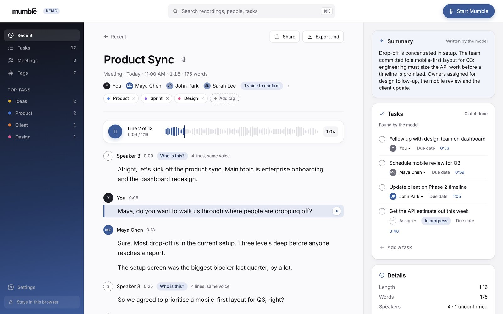
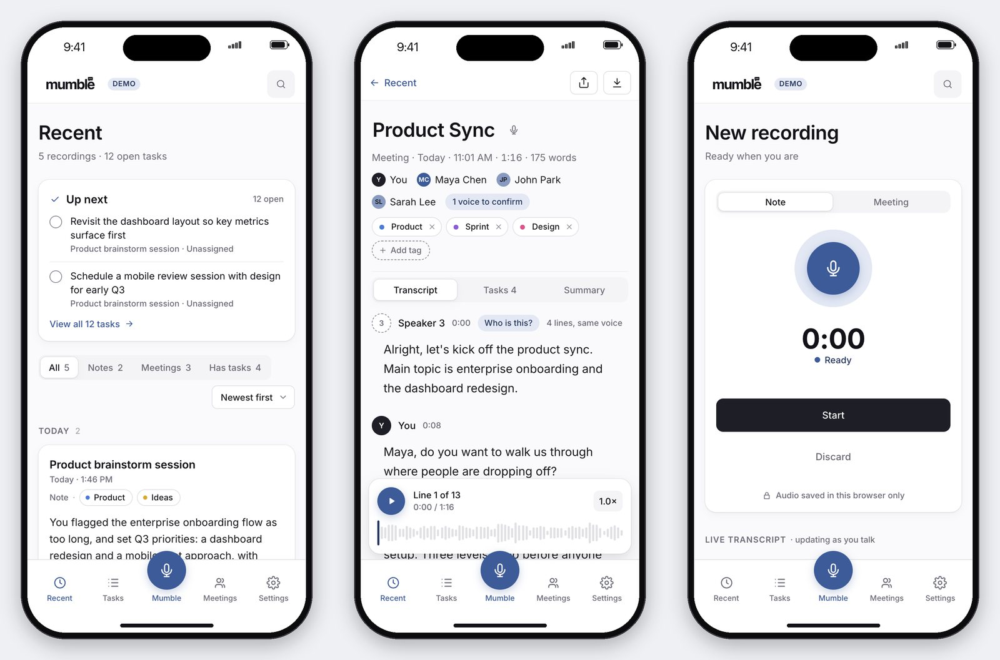
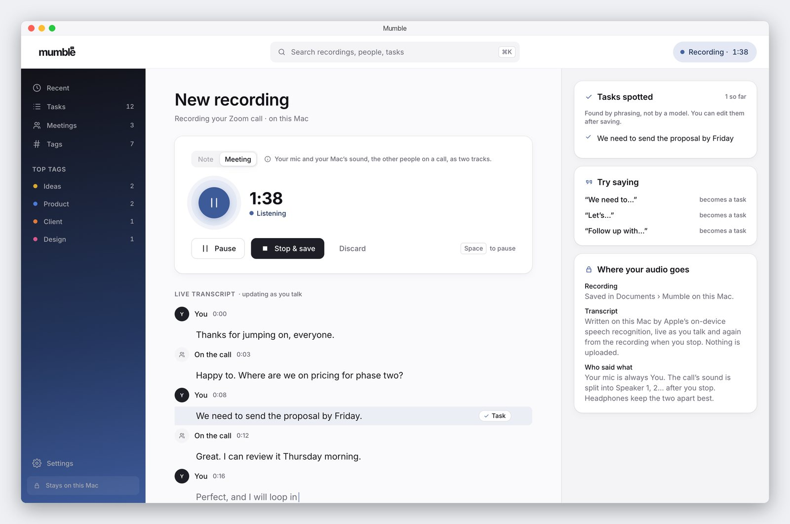
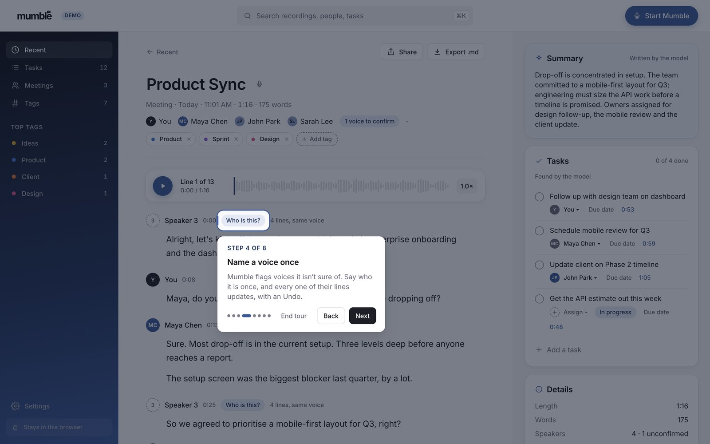

# Mumble

**Notes you speak instead of type.** Mumble transcribes as you talk, tells the
voices in a meeting apart, and pulls out the tasks, so you can listen back
instead of reading.

**▶ Live demo: [tommyclaffey.github.io/Mumble](https://tommyclaffey.github.io/Mumble/)** ·
[Team demo](https://tommyclaffey.github.io/Mumble/team/) (a made-up company, with faces) ·
[Phone link](https://web-production-b20ad.up.railway.app) (https, so recording works on a phone)

The demo opens with a welcome card and an 8-stop tour of the real screens.
Click **Demo** beside the logo to see it again.



Designed and engineered by [Tommy Claffey](https://www.tommyclaffey.com).

---

## Why it exists

Dictation solved getting words in. It didn't solve what comes after: every tool
hands back a wall of text to read, sort and retype. That cost lands hardest on
people who read slowly. Mumble makes the recording the thing you come back to:
press play and read along, with the line being spoken marked by a navy reading
bar, and the tasks already pulled out, each one pointing at the line it came from.

## What it does

| | |
|---|---|
| **Record** | A note (just you) or a meeting. The transcript appears as you talk; tasks are spotted from phrasing ("We need to…", "Let's…") and labelled as phrasing, not a model. |
| **Listen and read** | The recording plays with the transcript following line by line. Space plays, ← → move by line. Every waveform is measured from the real audio. |
| **Meeting mode** | After you stop, two small models **in the browser** tell the voices apart and put a speaker on every line. Lines it isn't sure of are flagged. **"Who is this?"** names a voice once, and every line in that voice updates, with an Undo. |
| **Tasks** | Grouped by status, assignable, and each one links back to the line it came from. Add your own; they say "Added by you". |
| **Dictation everywhere** | Anything you can type, you can say: every text field has a 🎤. |
| **Tags** | A picker in the tag style: type to filter or create, choose the colour yourself. |
| **Two demos** | Personal, and a team workspace (Harbor Labs) with people, roles and their own recordings, saved separately. |
| **Phone** | Its own layout, designed in Figma: a Transcript · Tasks · Summary switcher and a player docked above the tab bar. |



## Mumble for Mac

The same app as a native Mac app (`desktop/`, Swift, built with the Command
Line Tools only). The window shows these same web screens; the Mac adds what a
browser can't do:

- **Spots a meeting** (Zoom, Teams, Meet, FaceTime, Slack…) by which app is using
  the mic, and a small floating widget offers to record it.
- **Records two tracks**: your mic, and the Mac's sound (everyone else on the call).
  Your track is always **You**; only the other side needs telling apart.
- **Transcribes on the Mac**, live as you talk and again from the files after Stop,
  with Apple's on-device speech (macOS 26). Nothing is uploaded.
- Pause and resume, a menu bar item, open at login, and a `.dmg` installer.



It runs on the Mac that builds it (`desktop/make-dmg.sh --install`). Sharing it
needs a Developer ID signature and notarisation, which it doesn't have.
Details: [`desktop/README.md`](desktop/README.md).

## What's real, and what isn't

| | |
|---|---|
| **Recording and playback** | Real. Your recordings stay in your browser (IndexedDB). |
| **Live transcript** | Real: the browser's speech service. Chrome and Edge send the audio to their vendor for this; Safari keeps it on-device where it can; Firefox can't, and the app says so. The Mac app uses Apple's on-device speech instead. |
| **Meeting mode** | Real, in the browser. The first meeting downloads two models (about 33 MB). Measured on the demo meetings: the right person on 33 of 35 lines (94%). Those voices are synthetic and clean, so treat it as the best case. Not yet measured on a real meeting. |
| **Demo recordings** | Synthetic: one neural voice per person, generated once (`scripts/make-demo-audio.mjs`), and labelled as such. |
| **AI summaries** | Only on the demo recordings. New recordings say they have none, rather than fake one. |
| **Task suggestions** | A phrasing rule on new recordings, labelled as one. |
| **Team photos** | Real portraits from Unsplash ([credits](public/people/CREDITS.md)); the people, names and roles are made up. |

## Decisions worth defending

**A note and a meeting are different types.** One type with optional fields
everywhere is how "does this have speakers?" becomes a question every screen
answers differently. `kind` is a required discriminant.

**Correcting a speaker propagates by voice.** Diarization gets a person wrong
*consistently*: it decides turn 1 is "Speaker 2", then matches that voice forty
more times. Fixing one line and leaving thirty-nine wrong costs more than it saves.

**Design what happens when the model is wrong.** Unsure lines are flagged, the
fix is one action, and it can be undone. A transcript that hides its doubt is
the one people stop trusting.

**Never ship a control that doesn't do anything.** The Notion-inspired redesign
kept the ideas and dropped the decoration: no star, no "•••", no "Edited just
now" that doesn't mean anything. Every switch in Settings changes something real.

**The engineer did what the design said; the design was the bug.** The first
build matched the Figma almost exactly and still felt cheap, so the fix was a
visual pass in Figma (page 07 desktop, page 08 phone), then the code.



## Quality

- **183 tests** (Vitest + Testing Library), including fake voices that drive dictation,
  Meeting mode and the Mac app's bridge.
- **Accessibility**: axe in the tests, plus a real-Chrome audit of every screen at
  desktop and phone width, colour contrast included (`npm run audit:a11y`). It also
  takes the tour and checks the welcome card. Clean on both demos.
- **Reflow**: nothing scrolls sideways at 320 px (400% zoom).
- Real audio playback checked in Chrome; the reading bar follows the line.

## Stack

Vite · React · TypeScript · CSS custom properties. No component library and no
Tailwind: the primitives are the point. Meeting mode runs
[pyannote segmentation](https://huggingface.co/onnx-community/pyannote-segmentation-3.0)
and a speaker-embedding model through transformers.js in a Web Worker. The Mac
app is Swift: Core Audio process taps, SpeechAnalyzer, and a WKWebView.

```
src/
├── styles/        tokens.css (3 tiers) · type.css (named styles)
├── data/          model.ts (the domain) · demo.ts · teamDemo.ts · store.tsx · route.ts · workspace.ts
├── record/        recognizer · micRecorder · audioStore (IndexedDB) · diarize (+ worker) · waveform
├── playback/      usePlayer (a recording, line-aware)
├── components/    Surface, Chip, Button, PlayerBar, Waveform, SpeakerFix, TagEditor, Dictate,
│                  Welcome, Tour, …
├── desktop/       the web side of the Mac app (only active inside it)
├── shell/         header, sidebar, phone tab bar
└── screens/       Recent, Capture, Record, Tasks, Tags, Meetings, Team, Settings
desktop/           Mumble for Mac (Swift)
```

## Run it

```
npm install
npm run dev            # http://localhost:5173/Mumble/
npm test
npm run audit:a11y -- http://localhost:5173/Mumble/
desktop/make-dmg.sh --install     # the Mac app (macOS 26, Command Line Tools)
```

## Foundations

Transcribed from [the Figma file](https://www.figma.com/design/KKImFpu7qv988QP6CVi9Mz/Mumble-App)
via the plugin API: variables across three collections and named text styles,
not invented or approximated. Light mode only: the variable collection has one
mode, and an inverted palette would be a mode nobody designed.

Three things the design system doesn't define are named in one block in
`tokens.css`, so they're never mistaken for transcribed: the focus ring
(`accent/base`), the low-confidence tone, and border widths (1px and 2px).
